# SearchAndDoc_API

A backend API for a Discord app that enhances server search and leverages Large Language Models (LLMs) to generate documentation from project information discussed in Discord channels.

---

## Features

- **Advanced Search**: Enhanced, context-aware search capabilities for Discord servers.
- **Automated Documentation**: Uses LLMs to generate documentation based on channel discussions.
- **REST API**: Exposes endpoints for integration and automation.
- **Modular Design**: Clean separation of concerns for maintainability and extensibility.

---

## Tech Stack

- **Python 3.9+**
- **FastAPI** – Modern, high-performance web framework for APIs
- **Uvicorn** – Lightning-fast ASGI server for FastAPI
- **Pytest** – Robust testing framework
- **pre-commit** – Code formatting and linting hooks
- **pyenv** – Python version and virtual environment management
- **uv** – Fast dependency management with `pyproject.toml`
- **LLM Integration** – For generating documentation (see code for details)
- **Solr** – Search engine backend

---

## Server Architecture

The repo uses a **Monolothic** server architecture

## System architecture
The system follows an **MVC-inspired** software architecture, structured for APIs (no front-end views)

```mermaid
%%{init: {'theme': 'base', 'themeVariables': { 'primaryColor': '#ffd8b1', 'edgeLabelBackground':'#fff', 'fontSize': '200px', 'width': 100%, 'height': 100%}}}%%
classDiagram
    direction TB

    %% ====================
    %% Routers (Controller Layer)
    %% ====================
    class IndexDataRouter {
        +POST /index_data()
    }

    class CreateDocumentRouter {
        +POST /create-document()
    }

    class CollectionRouter {
        +POST /create-collection()
    }

    %% ====================
    %% Request DTOs (DTO Pattern)
    %% ====================
    class IndexDataRequest {
        +server_id: str
        +data: list[dict]
    }

    class CreateDocumentRequest {
        +server_id: str
        +topic: str
    }

    class CreateCollectionRequest {
        +server_id: str
        +shards: int
        +replicas: int
    }

    %% ====================
    %% Service Layer (Service Layer Pattern)
    %% ====================
    class IndexDataService {
        +index_data_service()
    }

    class CreateDocumentService {
        +create_document_service()
    }

    class CollectionService {
        +create_collection_service()
    }

    %% ====================
    %% Models (Repository + Strategy Pattern)
    %% ====================
    class SolrCollectionModel {
        +collection_exist()
        +create_collection()
        +get_collection_url()
    }

    class SemanticSearchModel {
        +semantic_search()
        +get_rows_count()
    }

    %% ====================
    %% Infrastructure (Factory + Facade)
    %% ====================
    class ConnectionFactoryService {
        +get_admin_client()
        +get_index_client()
        +get_search_client()
    }

    class SolrConfig {
        +SOLR_URL: str
        +COLLECTION_NAME: str
        +get_config()
    }

    class SolrDatabase {
        <<Database>>
    }

    %% ====================
    %% Relationships (Control & Data Flow)
    %% ====================
    IndexDataRouter --> IndexDataService : calls
    CreateDocumentRouter --> CreateDocumentService : calls
    CollectionRouter --> CollectionService : calls

    IndexDataService --> SolrCollectionModel : uses
    IndexDataService --> ConnectionFactoryService : gets client
    IndexDataService --> SolrDatabase : indexes data

    CreateDocumentService --> SolrCollectionModel : checks
    CreateDocumentService --> SemanticSearchModel : executes
    CreateDocumentService --> ConnectionFactoryService : gets client
    CreateDocumentService --> SolrDatabase : inserts doc

    CollectionService --> SolrCollectionModel : creates
    CollectionService --> ConnectionFactoryService : gets client
    CollectionService --> SolrDatabase : creates collection

    SemanticSearchModel --> SolrDatabase : queries
    SolrCollectionModel --> SolrDatabase : collection ops
    ConnectionFactoryService --> SolrConfig : reads config
    ConnectionFactoryService --> SolrDatabase : client factory

    %% ====================
    %% Pattern Annotations
    %% ====================
    note for IndexDataRequest "DTO Pattern\n- API input structure"
    note for CreateDocumentRequest "DTO Pattern\n- Clean transport model"
    note for CreateCollectionRequest "DTO Pattern\n- Request schema"

    note for IndexDataService "Service Layer Pattern\n- Contains logic for indexing"
    note for CreateDocumentService "Service Layer Pattern\n- Document handling"
    note for CollectionService "Service Layer Pattern\n- Collection mgmt"

    note for SolrCollectionModel "Repository Pattern\n- DB abstraction"
    note for SemanticSearchModel "Strategy Pattern\n- Plug-and-play search logic"

    note for ConnectionFactoryService "Factory Pattern\n- Builds Solr clients\nFacade Pattern\n- Unified DB client access"

    %% ====================
    %% MVC + Architecture Notes
    %% ====================
    note "MVC Pattern (No View):\nRouters = Controllers\nServices = Business Logic\nModels = Data Layer"
    note "Monolithic Server Architecture:\nAll components in a single deployable unit\nNo independent services"
```




- **Routers**:
  - Receive and validate HTTP requests.
  - Delegate processing to the appropriate service layer.
  - Located in the `routers/` directory.

- **Models**:
  - Define Pydantic schemas for request/response validation.
  - Provide data models for interacting with service layers and the database.
  - Located in the `models/` directory.

- **Service Layers**:
  - Contain business logic for search, indexing, and documentation generation.
  - Orchestrate communication between models, database, and LLMs.
  - Located in the `services/` directory.

- **Factory Functions**:
  - Manage creation and configuration of database connections and clients.
  - Ensure efficient and reusable connection handling.
  - Located in the `services/` and `utils/` directories.

- **Database (Solr)**:
  - Stores and indexes Discord messages and metadata.
  - Supports advanced search queries and retrieval.

---

## Requirements

- Python >= 3.9
- [pyenv](https://github.com/pyenv/pyenv) (recommended)
- [uv](https://docs.astral.sh/uv/) (for dependency management)
- Running [Solr](https://solr.apache.org/) instance (see `db/config/solr_config.py` for configuration)

---

## Setup

1. **Install Python 3.9.20 with pyenv**
```shell
CONFIGURE_OPTS="--with-openssl=/opt/Homebrew/Cellar/openssl@3/3.4.1" pyenv install -v 3.9.20
```

2. **Set Local Python Version**
```shell
pyenv local 3.9.20
```

3. **Create and Activate a Virtual Environment**
```shell
pyenv virtualenv 3.9.20 <virtual_env_name>
pyenv activate <virtual_env_name>
```

4. **Install Project Dependencies**
```shell
pip install uv
uv sync
```


---

## Development

### Run Pre-Commit Hooks

Format and lint code before committing:

```shell
pre-commit run -a
```

### Run Tests

Execute all tests with:
```shell
python3 -m pytest
````

### Run the Server
Start the FastAPI server with:
```shell
uvicorn main:app --reload
```


- The API will be available at [http://127.0.0.1:8000](http://127.0.0.1:8000)
- Interactive API docs: [http://127.0.0.1:8000/docs](http://127.0.0.1:8000/docs)

---

## Project Structure
.
├── main.py # FastAPI application entrypoint
├── routers/ # API routers (endpoints)
├── services/ # Core business logic and integrations
├── models/ # Pydantic models and data schemas
├── utils/ # Utility functions and helpers
├── db/ # Database configs and connection factories
├── tests/ # Automated tests
├── pyproject.toml # Project metadata and dependencies
└── README.md
